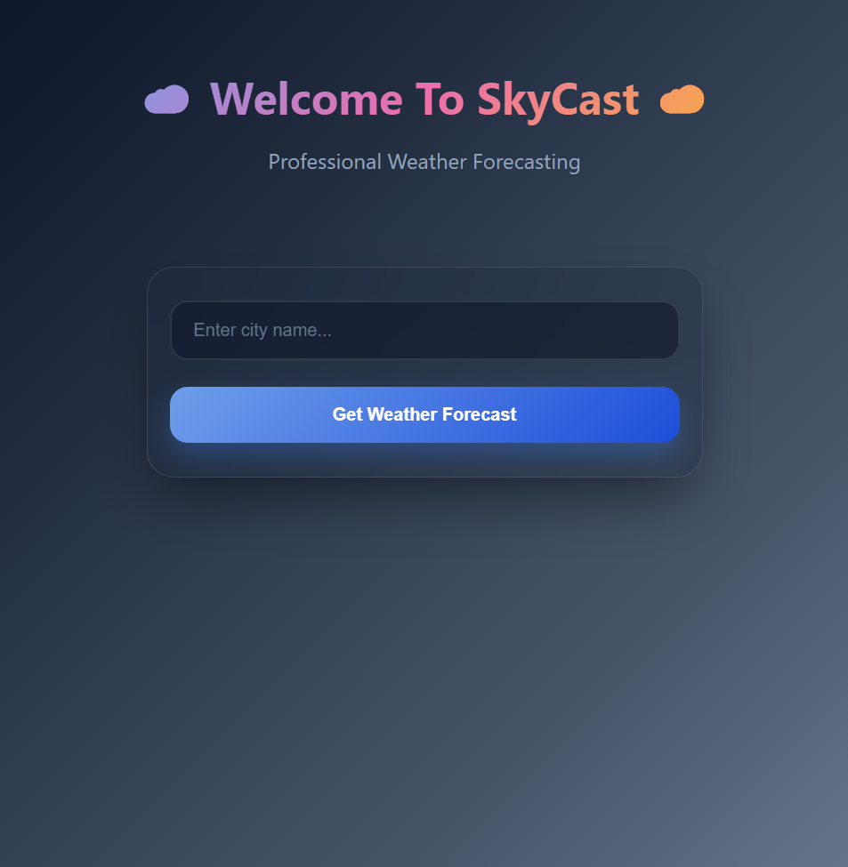
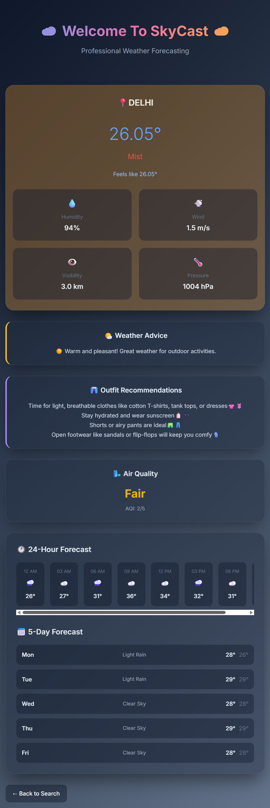

# SkyCast Weather App

A Flask-based weather application that provides real-time weather data, forecasts, and intelligent outfit recommendations using the OpenWeatherMap API.

**Live Demo:** [https://skycastweatherapp.pythonanywhere.com/](https://skycastweatherapp.pythonanywhere.com/)

## Features

- **Current Weather Data**: Real-time temperature, humidity, wind speed, visibility, and atmospheric pressure
- **Weather Forecasts**: 5-day forecast with detailed daily predictions
- **Smart Recommendations**: Weather-based outfit suggestions and activity advice
- **Air Quality Information**: Current Air Quality Index (AQI) data
- **Error Handling**: Graceful handling of invalid city names and API errors
- **Responsive Design**: Clean, mobile-friendly interface

## Demo Screenshots

### Home Page


### Weather Results  


## Technology Stack

- **Backend**: Python, Flask
- **Frontend**: HTML5, CSS3, JavaScript
- **API**: OpenWeatherMap API (Current Weather, Forecast, Air Pollution)
- **Deployment**: PythonAnywhere
- **Environment Management**: python-dotenv

## Project Structure

```
weather-app/
├── app.py                 # Main Flask application
├── static/
│   └── style.css         # Application styling
├── templates/
│   ├── index.html        # Home page template
│   └── results.html      # Results page template
├── screenshots/          # Application screenshots
├── requirements.txt      # Python dependencies
├── .env                 # Environment variables (not included)
└── README.md            # Project documentation
```

## Installation and Setup

### Prerequisites
- Python 3.7 or higher
- OpenWeatherMap API key ([Get one free here](https://openweathermap.org/api))

### Local Development

1. **Clone the repository**
   ```bash
   git clone https://github.com/yourusername/weather-app.git
   cd weather-app
   ```

2. **Install dependencies**
   ```bash
   pip install -r requirements.txt
   ```

3. **Set up environment variables**
   Create a `.env` file in the root directory:
   ```
   API_KEY=your_openweathermap_api_key_here
   ```

4. **Run the application**
   ```bash
   python app.py
   ```

5. **Access the application**
   Open your browser and navigate to `http://127.0.0.1:5000`

## API Integration

This application integrates with three OpenWeatherMap API endpoints:

- **Current Weather API**: Real-time weather conditions
- **5-Day Weather Forecast**: Extended weather predictions
- **Air Pollution API**: Air quality index and pollutant data

## Smart Features

### Outfit Recommendations
The app provides intelligent clothing suggestions based on:
- Current temperature and feels-like temperature
- Weather conditions (rain, snow, wind)
- Time of day and season

### Activity Suggestions
Weather-appropriate activity recommendations including:
- Outdoor activities for favorable conditions
- Indoor alternatives during poor weather
- Safety advisories for extreme conditions

## Deployment

The application is deployed on PythonAnywhere with:
- Automatic environment variable management
- Error logging and monitoring
- HTTPS security

## Error Handling

Robust error handling for:
- Invalid city names
- API rate limits
- Network connectivity issues
- Malformed API responses

## Future Enhancements

- [ ] Weather alerts and notifications
- [ ] Historical weather data
- [ ] Multi-language support
- [ ] Weather maps integration
- [ ] User preferences and favorites

## Contributing

1. Fork the repository
2. Create a feature branch (`git checkout -b feature/new-feature`)
3. Commit your changes (`git commit -am 'Add new feature'`)
4. Push to the branch (`git push origin feature/new-feature`)
5. Create a Pull Request

## License

This project is licensed under the MIT License - see the LICENSE file for details.

## Acknowledgments

- Weather data provided by [OpenWeatherMap](https://openweathermap.org/)
- Deployed on [PythonAnywhere](https://www.pythonanywhere.com/)

---

**Note**: This is an educational project demonstrating API integration, web development, and deployment practices.
